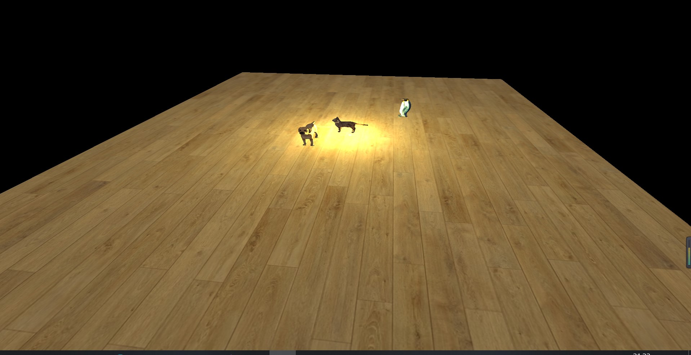

# CSCI3260 Assignment 2 Texture Mapping/ Lighting Control  (100/100)
## Name:Yu ZHIHAO Student ID: 1155141497
### 

#### Key "W": brightness of light increase
#### Key "S": brightness of light decrease
#### Key "UP": Cat move forward
#### Key "Down":Cat move backward
#### Key "Left": Cat turn to the left
#### Key "Right": Cat turn to the Right
#### Key "1": Change the cat texture as texture1
#### Key "2": Change the cat texture as texture2
#### Key "3": Change the Floor texture as texture1
#### Key "4": Change the Floor texture as texture2
#### Key "B": Blinn-Phong effect turn on(refer to https://learnopengl.com/Advanced-Lighting/Advanced-Lighting)
#### Key "Z": Blinn-Phong effect turn off
#### Mouse (left click and drag upward) : whole scene move upward
#### Mouse (left click and drag downward) : whole scene move downward
#### Mouse (left click and drag to the left) : whole scene rotate left
#### Mouse (left click and drag to the Right) : whole scene rotate Right
#### Mouse (Scroll forward) : whole scene zoom in
#### Mouse (Scroll backward) : whole scene zoom out                
#### Object: Cat, Dog, Penguin and floor
#### Lightning: Directional light and point light,while we can control the intensity of directional light
#### Offer Texture control,Object control, Light Control and View control
#### Offer different types of lighting sources(Directional light and point light
#### Offer a Advanced Lighting called Blinn-Phong, howerver, no too much obvious changes with little specular improvement
                
	

